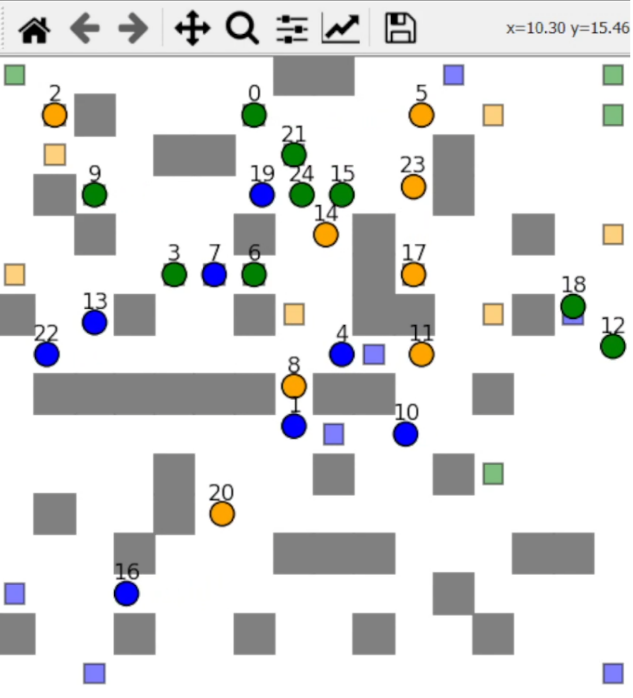
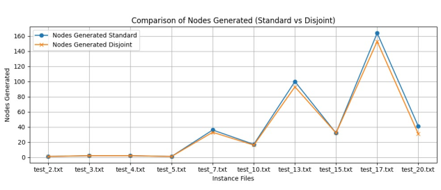
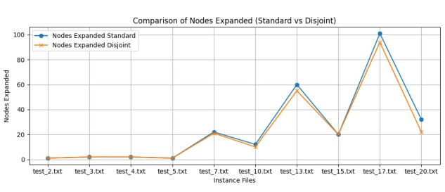
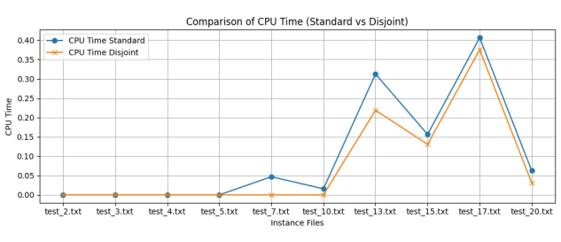

# Decentralized Multi Agnet Path Finding with ICBS

<!-- PROJECT LOGO -->
 

<!-- ABOUT THE PROJECT -->
## About The Project
The central focus of our investigation pertains to the advance-
ment of Multi-Agent Path Finding (MAPF) by incorporating
decentralized planning methodologies with Improved Conflict-
Based Search (I-CBS). This fusion is designed to tackle the
challenges posed by intricate environments where numerous
agents, each governed by dynamic constraints, must navigate
while avoiding collisions. The ramifications of this project
extend across diverse domains, including robotics, autonomous
vehicles, and industrial automation. Resolving MAPF in a
decentralized manner, shows significant potential for enhancing
the efficiency, safety, and scalability of multi-agent systems
operating in dynamic and unpredictable environments.

   

 

<!-- ABOUT THE PROJECT -->
## How to build and run tests
Please follow given steps to successfully run the whole project.

* Edit the file path in the ’run experiments.py’ file where the variable instance file path is defined. Now run this
file ’run experiments.py’ and you will have the output
* To change the map , you just need to change your instance file path and give it a different file path and you will
have another map.
* Switching between Disjoint and Standard Splitting: In ’run experiments.py’ file at line 49 and 50 there are
solutions defined, unhash the one you need to perform and keep the other one hashed, by default the program
will run standard splitting.
solution = cbs.find solution(disjoint= ”standard splitting” ,a star version=”a star”)
#solution = cbs.find solution(disjoint= ”disjoint splitting” ,a star version=”a star”)
* To run all the instances at once and get the result into the csv file, you need to add the path of your instances
directory in the instances directory variable at line 8 of ’test.py file’ and add the path with the file name where
you want to save the csv file in, at the variable name csv filename at line 79 of the same file. Now run the test.py
and csv file will be saved at the given path.

After Successfully running the above command you will see a pop up window with the visualization.

(<a href="#readme-top">back to top</a>)

## Conclusion:
* The comparison of nodes generated for
standard and disjoint method of CBS search are compared the
results clearly showed that the disjoint splitting was effective
than standard splitting and it reduced the nodes generated for
all the cases till test case 5, the reference was not prominent
but as the number of robot increased the results were clearly
seen for test case 17, the generated node for standard splitting
were 162 and that of disjoint splitting were less than 150. The
results are close to expected outcome of the project.

\

* The nodes expanded are compared
for both algorithm extensions, the graph for result 2 shows
that disjoint splitting showed effective performance in node
expansion, here as well the disjoint splitting outperforms than
standard splitting after test case 7 the difference between the
nodes expansion of these 2 extensions were clearly visible still
there was a case for test 15 when both algorithm expanded same
number of nodes and on other side for test case 20 the difference
in number of nodes expanded was 11.

* The time utilization for individual
algorithm extensions are compared, the average time required
for both algorithm extensions was about 0.3 seconds for maxi-
mum 25 agents which shows both the algorithm extension were
time effective while considering the comparison between the
standard and disjoint splitting as per the expectations the disjoint
splitting showed better results than the standard splitting. For
test case 7 the standard splitting took 0.05 second while disjoint
splitting took 0.01 second, which shows a clear difference in the
performance.

<!-- GETTING STARTED -->

(<a href="#readme-top">back to top</a>)

### Required Libraries
1) time
2) heapq
3) random
4) copy
5) numpy
6) itertools - product
7) matplotlib

(<a href="#readme-top">back to top</a>)

<!-- CONTRIBUTING -->
## Contributing

Contributions are what make the open source community such an amazing place to learn, inspire, and create. Any contributions you make are *greatly appreciated*.

If you have a suggestion that would make this better, please fork the repo and create a pull request. You can also simply open an issue with the tag "enhancement".
Don't forget to give the project a star! Thanks again!

1. Fork the Project
2. Create your Feature Branch (git checkout -b feature/GridSearch)
3. Commit your Changes (git commit -m 'Add some GridSearch')
4. Push to the Branch (git push origin feature/GridSearch)
5. Open a Pull Request

(<a href="#readme-top">back to top</a>)

<!-- CONTACT -->
## Contact

Name - Anuj Jagetia - ajagetia@wpi.edu

Project Link: [https://github.com/jagrox5/MAPF_ICBS/](https://github.com/jagrox5/MAPF_ICBS/)

(<a href="#readme-top">back to top</a>)

<!-- ACKNOWLEDGMENTS -->
## Acknowledgments
